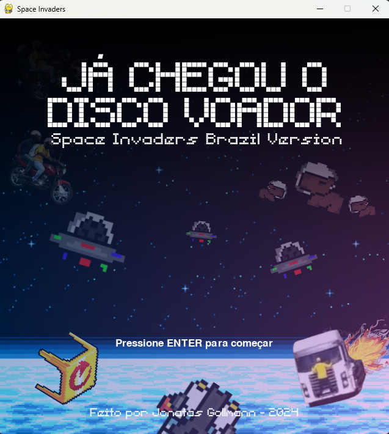
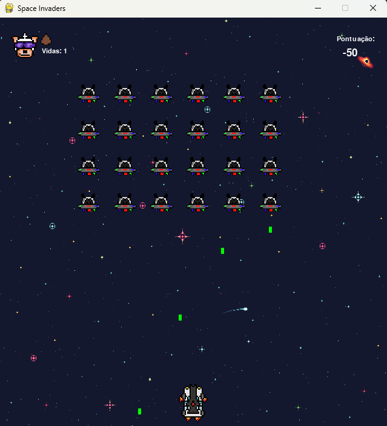
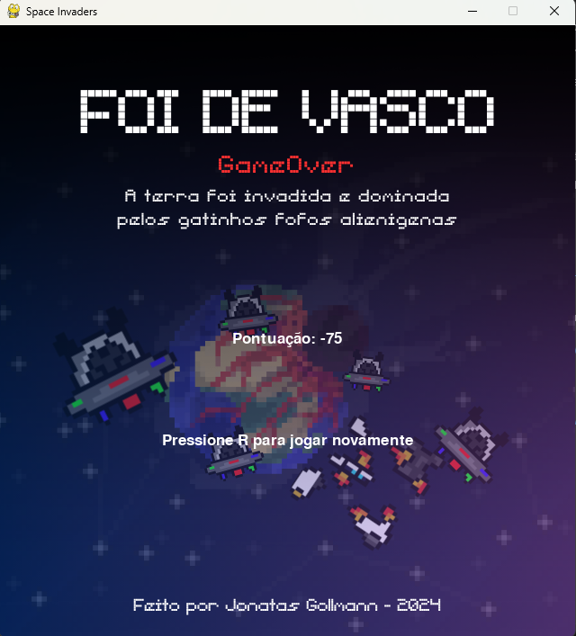

# Space Invaders - Brazil Version
### Feito por Jonatas Gollmann
Esse jogo foi feito a partir da proposta de trabalho II da disciplina de Linguagem de Programação I do Curso de Engenharia da computação da faculdade Dom Alberto.

Todos sprites usados no jogo são de autoria propria, utilizando referencias brasileiras. Com exceção da mesa, das imagens usadas de background e das montagens em alta resolução que foram retiradas da internet.
Foram utilizadas tambem músicas brasileiras em 8 e 16 bits e efeitos em 8 bits retiradas do YouTube.

Foram utilizadas as seguintes tecnologias.
- Python 3
- PyGame
- Piskel (Desenvolvimento dos sprites usados no jogo)

#### Sobre o jogo:
- Conta com pontuação dinâmica, onde:
    - Cada inimigo abatido é  **+50 pontos.**
    - Cada tiro que não é acertado **-10 pontos**
    - Cada acerto do inimigo na nave é **-25 pontos**
- Musicas brasileiras.
- Backgrounds com referências a virais da internet.

### Links
#### Coração Verde e Amarelo - Aerobanda | Edu Moonwalker
Vitoria: https://www.youtube.com/watch?v=onXtd-g_mbo
 
#### Legião Urbana - Tempo Perdido | Otaku Bits
Start: https://www.youtube.com/watch?v=0ACgvMRTfjc

#### Hino do Vasco - Clubes em 8-bits
GameOver: https://www.youtube.com/watch?v=tehFoER2e2E

## Screenshots:

